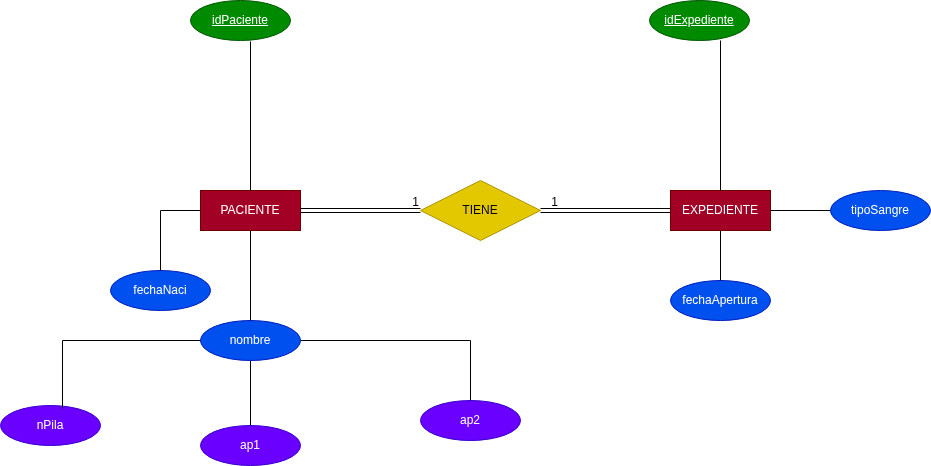
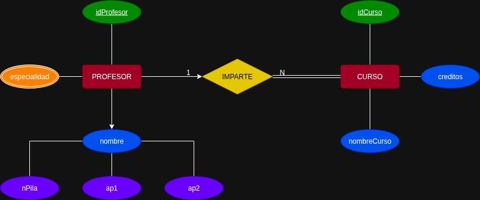
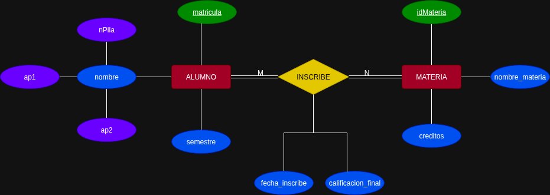
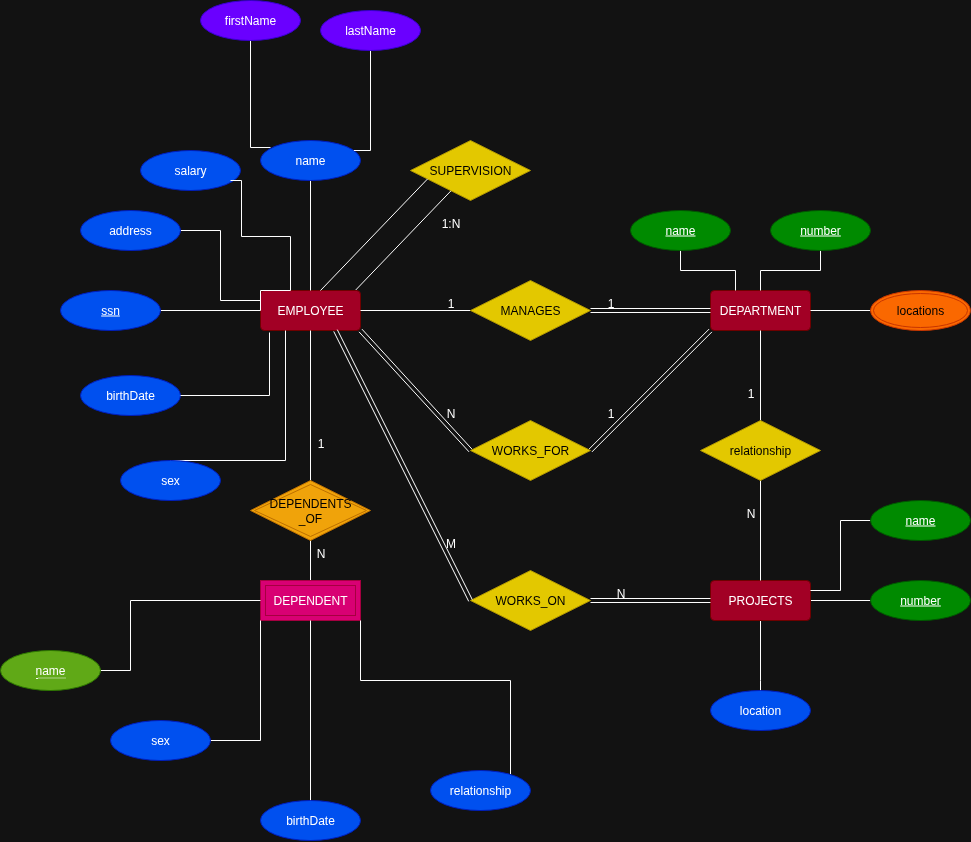
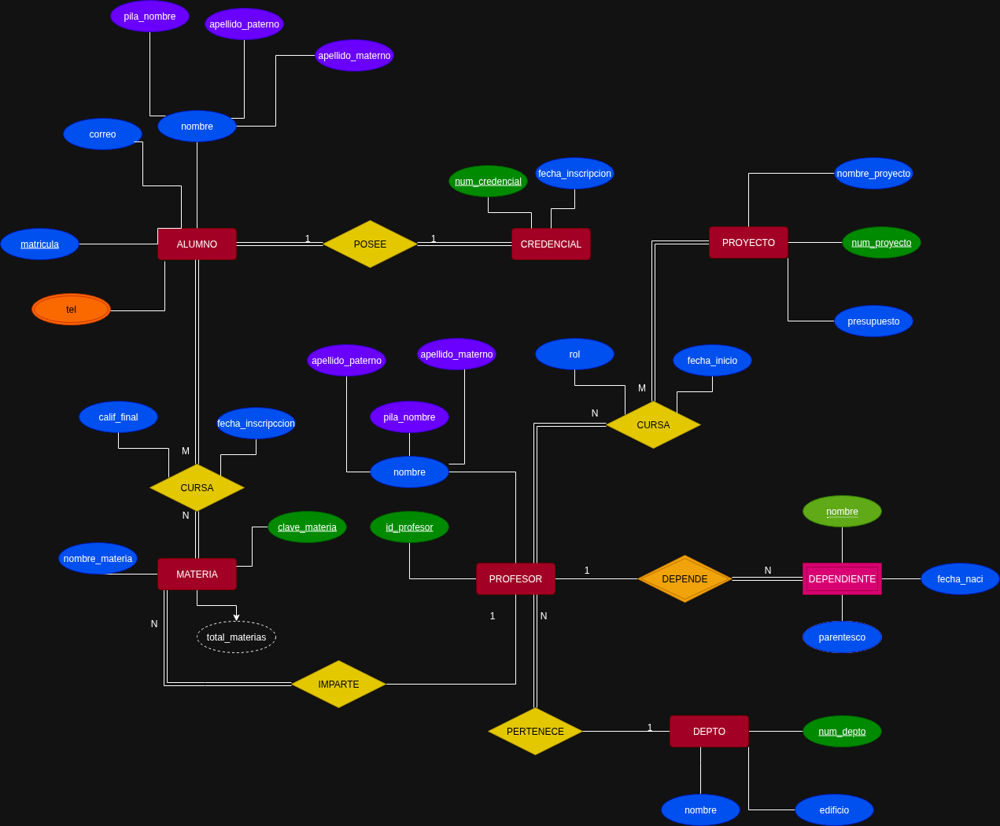

# Ejercicios del Modelo E-R

## Ejercicio 1

Un hospital registra información de sus pacientes.

> **De cada paciente se almacena:**
>
> - Número de paciente que lo identifica
> - Nombre
> - Fecha de nacimiento

> **De cada expediente médico se almacena:**
>
> - Número de expediente
> - Fecha de apertura
> - Tipo de sangre

> **Reglas del negocio:**
>
> 1. Cada paciente debe tener exactamente un expediente médico.
> 2. Cada expediente médico pertenece a un único paciente.
> 3. No puede existir un expediente sin paciente.
> 4. No puede existir un paciente sin expediente.

> **Qué se debe realizar:**
>
> - Identificar las entidades.
> - Identificar los atributos.
> - Dibujar las relaciones.
> - Determinar la cardinalidad.
> - Determinar la participación de cada entidad.

---

## Ejercicio 2

Una universidad administra profesores y cursos.

> **De cada profesor se almacena:**
>
> - Número de profesor
> - Especialidad
> - Nombre

> **De cada curso se almacena:**
>
> - Número de curso
> - Nombre del curso
> - Créditos

> **Reglas del negocio:**
>
> 1. Un profesor puede impartir varios cursos.
> 2. Un curso solamente puede ser impartido por un profesor.
> 3. Puede existir un profesor que actualmente no imparta cursos.
> 4. Todo curso debe estar asignado a un profesor.

---

## Ejercicio 3

Una escuela administra alumnos y materias.

> **De cada alumno se almacena:**
>
> - Matrícula
> - Nombre
> - Semestre

> **De cada materia se almacena:**
>
> - Clave de la materia
> - Nombre de la materia
> - Créditos

> **Reglas del negocio:**
>
> 1. Un alumno puede inscribirse en varias materias.
> 2. Una materia puede tener muchos alumnos inscritos.
> 3. Puede existir una materia sin alumnos inscritos.
> 4. Todo alumno debe estar inscrito en al menos una materia.
> 5. De cada inscripción se desea almacenar:
>    - Fecha de inscripción
>    - Calificación final

> **Nota:**
> A la relación se le debe nombrar **Inscribe**.

---

## Ejercicio 4

Una empresa dedicada a las ventas al por mayor necesita registrar lo siguiente.

> **Para los clientes se almacena:**
>
> - Número de cliente
> - Nombre de la persona moral

> **De cada pedido se almacena:**
>
> - Número de pedido
> - Fecha de pedido

> **De cada producto se almacena:**
>
> - Número de producto
> - Nombre
> - Precio

> **Reglas del negocio:**
>
> 1. Un cliente puede realizar muchos pedidos.
> 2. Cada pedido pertenece a un solo cliente.
> 3. Un pedido contiene varios productos.
> 4. Un producto puede aparecer en muchos pedidos.
> 5. Un pedido debe contener al menos un producto.
> 6. Un producto puede no haber sido vendido.
> 7. El detalle del pedido no existe sin pedido.
> 8. El detalle del pedido no existe sin producto.
> 9. El detalle almacena cantidad vendida y precio de venta.

## Ejercicio 5

### Company Database Requirements

#### 1. Departments

The company is organized into **departments**.

> **Each department has:**
>
> - A unique name
> - A unique number
> - A particular employee who manages the department
> - The start date when that employee began managing the department
> - Several possible locations

> A department may have several locations.

---

#### 2. Projects

A department controls a number of **projects**.

> **Each project has:**
>
> - A unique name
> - A unique number
> - A single location

---

#### 3. Employees

> **We store each employee’s:**
>
> - Name
> - Social Security number
> - Address
> - Salary
> - Sex / gender
> - Birth date

An employee is assigned to **one department**, but may work on **several projects**.

These projects are not necessarily controlled by the same department to which the employee belongs.

> **We also keep track of:**
>
> - The current number of hours per week that an employee works on each project
> - The direct supervisor of each employee

The direct supervisor is another employee.

---

#### 4. Dependents

We want to keep track of the **dependents** of each employee for insurance purposes.

> **For each dependent, we keep:**
>
> - First name
> - Sex
> - Birth date
> - Relationship to the employee

# Ejercicio 6

Una institución educativa requiere gestionar la información de su comunidad académica y administrativa.

> **De cada alumno se almacena:**
>
> - Matrícula
> - Nombre (Nombre de pila, Apellido paterno, Apellido materno)
> - Correo
> - Teléfono (pueden ser varios)

> **De cada credencial se almacena:**
>
> - Número de credencial
> - Fecha de inscripción

> **De cada materia se almacena:**
>
> - Clave de la materia
> - Nombre de la materia
> - Total de materias

> **De cada profesor se almacena:**
>
> - ID del profesor
> - Nombre (Nombre de pila, Apellido paterno, Apellido materno)

> **De cada proyecto se almacena:**
>
> - Número de proyecto
> - Nombre del proyecto
> - Presupuesto

> **De cada departamento (DEPTO) se almacena:**
>
> - Número de departamento
> - Nombre
> - Edificio

> **De cada dependiente se almacena:**
>
> - Nombre
> - Fecha de nacimiento
> - Parentesco

> **Reglas del negocio:**
>
> 1. Un alumno posee exactamente una credencial y esta pertenece a un único alumno. No existe alumno sin credencial ni credencial sin alumno.
> 2. Un alumno puede cursar muchas materias y una materia puede ser cursada por muchos alumnos. Todo alumno debe cursar al menos una materia y toda materia debe tener alumnos inscritos.
> 3. De la inscripción de un alumno en una materia se debe registrar: la fecha de inscripción y la calificación final.
> 4. Un profesor puede impartir varias materias, pero una materia solamente puede ser impartida por un profesor. Puede haber profesores que no impartan materias, pero toda materia debe tener un profesor asignado.
> 5. Un profesor puede participar en muchos proyectos y un proyecto puede contar con muchos profesores. Todo profesor debe estar asignado a un proyecto y todo proyecto debe tener profesores colaboradores.
> 6. De la participación del profesor en el proyecto se registra: el rol y la fecha de inicio.
> 7. Un profesor pertenece obligatoriamente a un único departamento, mientras que un departamento puede tener muchos profesores adscritos o ninguno actualmente.
> 8. Un profesor puede tener muchos dependientes asociados o ninguno. Cada dependiente pertenece a un solo profesor y no puede existir en el sistema si el profesor no está registrado.

> **Qué se debe realizar:**
>
> - Identificar las entidades.
> - Identificar los atributos.
> - Dibujar las relaciones.
> - Determinar la cardinalidad.
> - Determinar la participación de cada entidad.

