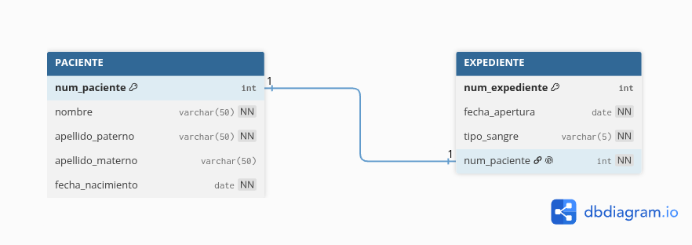
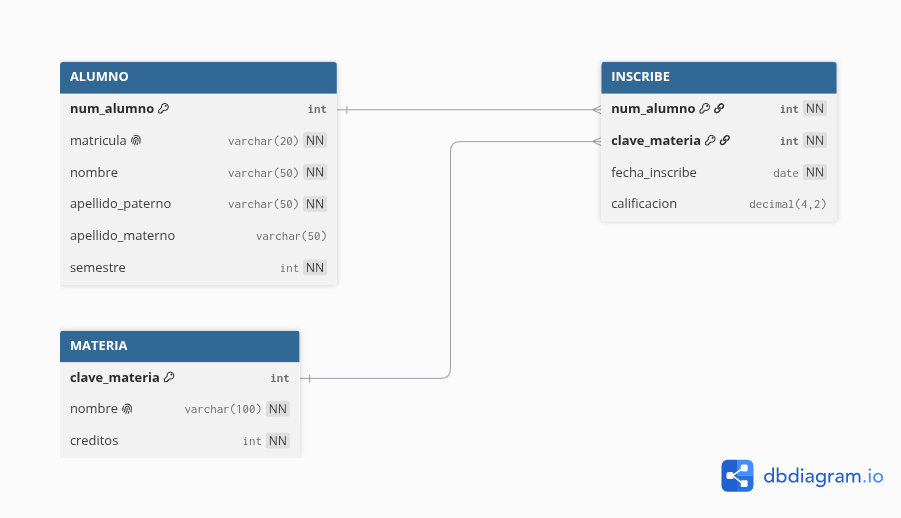
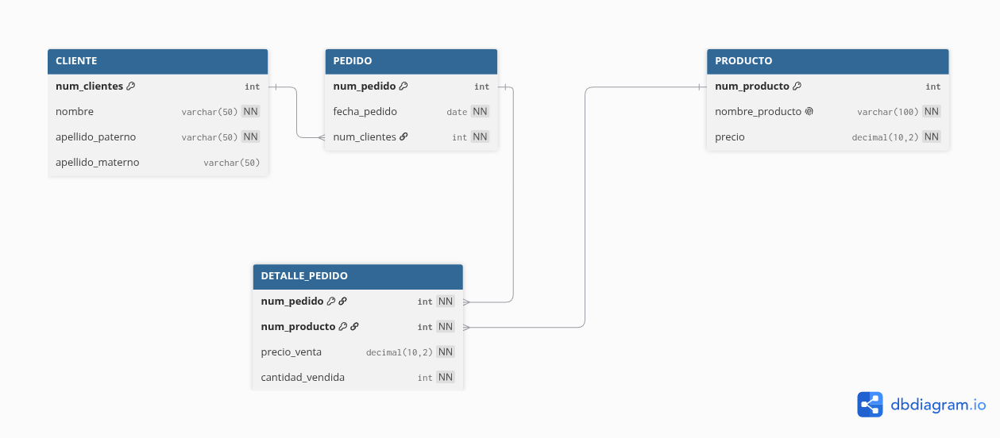
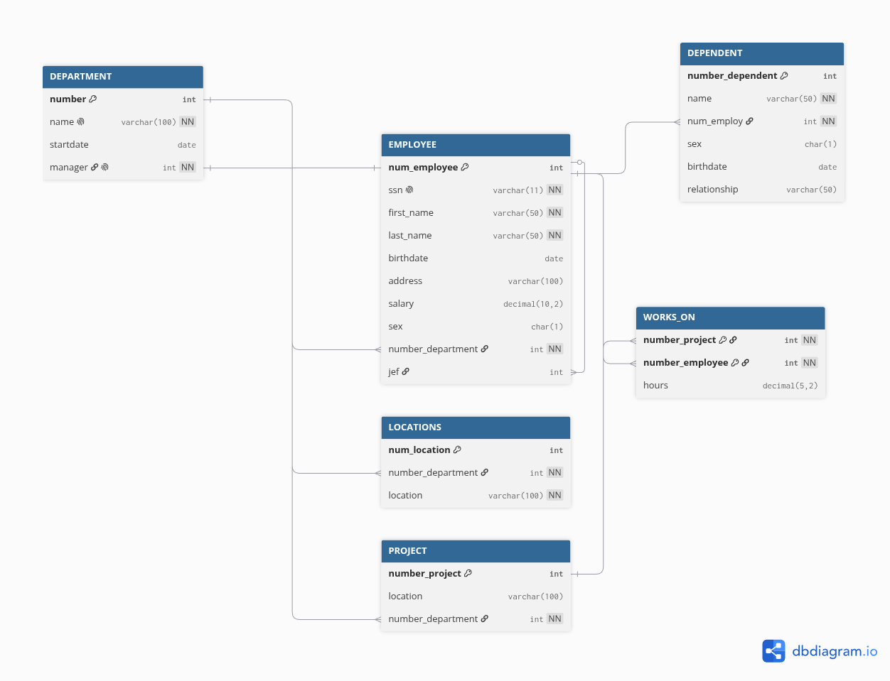
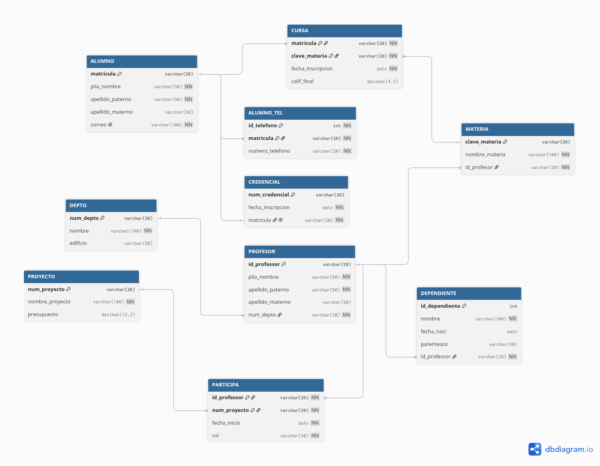

# Diccionario de Datos de la Base de Datos: Gestión Médica

## 1. Información General

| Elemento | Valor |
| :--- | :--- |
| **Proyecto** | Control de Expedientes Clínicos |
| **Versión** | 1.0 |
| **Fecha** | Junio 2026 |
| **Elaboró** | Ing. Eduardo Coronado Santana |
| **SGBD** | SQL SERVER |

---

## 2. Descripción de la Base de Datos

La base de datos administra:

- Paciente
- Expediente

Permite controlar la información personal de los pacientes y la gestión, apertura e integridad de sus expedientes clínicos individuales.

---

## 3. Catálogo de Restricciones Utilizadas

| Catálogo | Significado |
| :--- | :--- |
| **PK** | Primary Key (Clave Primaria) |
| **FK** | Foreign Key (Clave Foránea) |
| **NN** | Not Null (No Nulo) |
| **UQ** | Unique (Único) |
| **AI** | Identity (Autoincrementable) |

---

## 4. Diccionario de Datos

### **Tabla:** *Paciente*

**Descripción:** Almacena los datos de identificación personal e información básica de los pacientes de la clínica.

| Campo | Tipo | Longitud | Restricciones | Descripción |
| :--- | :--- | :--- | :--- | :--- |
| `num_paciente` | INT | - | PK, AI, NN | Identificador único e irrepetible del paciente (Identity). |
| `nombre` | VARCHAR | 50 | NN | Nombre o nombres del paciente. |
| `apellido_paterno` | VARCHAR | 50 | NN | Apellido paterno del paciente. |
| `apellido_materno` | VARCHAR | 50 | *Null* | Apellido materno del paciente (opcional). |
| `fecha_nacimiento` | DATE | - | NN | Fecha de nacimiento para el cálculo de la edad. |

---

### **Tabla:** *Expediente*

**Descripción:** Almacena la información de los expedientes clínicos y el historial médico asignado a cada paciente.

| Campo | Tipo | Longitud | Restricciones | Descripción |
| :--- | :--- | :--- | :--- | :--- |
| `num_expediente` | INT | - | PK, AI, NN | Número de folio único y autoincrementable del expediente. |
| `fecha_apertura` | DATE | - | NN | Fecha exacta en la que se aperturó el expediente clínico. |
| `tipo_sangre` | VARCHAR | 5 | NN | Grupo sanguíneo y factor Rh del paciente (ej. O+, A-). |
| `num_paciente` | INT | - | FK, UQ, NN | Enlace exclusivo al paciente dueño del expediente (Garantiza relación 1:1). |

---

## 5. Relaciones en la Base de Datos

| Relación | Cardinalidad | Descripción |
| :--- | :--- | :--- |
| Paciente -> Expediente | 1:1 | Un paciente posee un único expediente clínico y un expediente pertenece a un único paciente. |

---

## 6. Matriz de Claves Foráneas

| Tabla | Campo FK | Referencia |
| :--- | :--- | :--- |
| Expediente | `num_paciente` | Paciente(`num_paciente`) |

---

## 7. Integridad Referencial

| Clave | Regla |
| :--- | :--- |
| **IR-01** | No se puede crear ni asignar un expediente clínico a un número de paciente que no exista previamente en la tabla Paciente. |
| **IR-02** | No se puede eliminar un registro de la tabla Paciente si este ya cuenta con un registro asociado en la tabla Expediente (Restricción de eliminación). |

---

## 8. Reglas de Negocio

| Clave | Regla |
| :--- | :--- |
| **RN-01** | Un paciente puede tener asignado solamente un único expediente clínico en todo el sistema. |
| **RN-02** | Un expediente clínico no puede ser compartido entre dos o más pacientes; es de carácter estrictamente individual. |
| **RN-03** | La fecha de apertura del expediente no puede ser anterior a la fecha de nacimiento del paciente relacionado. |

---

## 9. Diagrama Relacional

# Diccionario de Datos de la Base de Datos: Control Académico

## 1. Información General

| Elemento | Valor |
| :--- | :--- |
| **Proyecto** | Sistema de Control Académico y Profesores |
| **Versión** | 1.0 |
| **Fecha** | Junio 2026 |
| **Elaboró** | Ing. Eduardo Coronado Santana |
| **SGBD** | SQL SERVER |

---

## 2. Descripción de la Base de Datos

La base de datos administra:

- Curso
- Profesor
- Especialidad

Permite controlar la oferta de cursos, la asignación y datos personales de los profesores, así como el registro de las especialidades profesionales que posee cada docente.

---

## 3. Catálogo de Restricciones Utilizadas

| Catálogo | Significado |
| :--- | :--- |
| **PK** | Primary Key (Clave Primaria) |
| **FK** | Foreign Key (Clave Foránea) |
| **NN** | Not Null (No Nulo) |
| **AI** | Identity (Autoincrementable) |

---

## 4. Diccionario de Datos

### **Tabla:** *Curso*

**Descripción:** Almacena los cursos o asignaturas que oferta la institución académica.

| Campo | Tipo | Longitud | Restricciones | Descripción |
| :--- | :--- | :--- | :--- | :--- |
| `numero_curso` | INT | - | PK, AI, NN | Identificador único y autoincrementable del curso. |
| `nombre_curso` | VARCHAR | 100 | NN | Nombre oficial de la asignatura o curso. |
| `creditos` | INT | - | NN | Cantidad de créditos académicos que otorga el curso. |

---

### **Tabla:** *Profesor*

**Descripción:** Almacena los datos de identificación de los profesores y los vincula al curso al que pertenecen.

| Campo | Tipo | Longitud | Restricciones | Descripción |
| :--- | :--- | :--- | :--- | :--- |
| `numero_profesor` | INT | - | PK, AI, NN | Número de nómina o identificador único del profesor. |
| `nombre` | VARCHAR | 50 | NN | Nombre o nombres del docente. |
| `apellido_paterno` | VARCHAR | 50 | NN | Apellido paterno del docente. |
| `apellido_materno` | VARCHAR | 50 | *Null* | Apellido materno del docente (opcional). |
| `numero_curso` | INT | - | FK, NN | Enlace al curso asignado (Relación N:1, muchos profesores a un curso). |

---

### **Tabla:** *Especialidad*

**Descripción:** Almacena las distintas especialidades, maestrías o certificaciones técnicas que ostentan los profesores.

| Campo | Tipo | Longitud | Restricciones | Descripción |
| :--- | :--- | :--- | :--- | :--- |
| `id_especialidad` | INT | - | PK, AI, NN | Identificador único de registro de la especialidad. |
| `nombre` | VARCHAR | 100 | NN | Nombre o título de la especialidad profesional. |
| `numero_profesor` | INT | - | FK, NN | Enlace al profesor que posee dicha especialidad (Relación N:1). |

---

## 5. Relaciones en la Base de Datos

| Relación | Cardinalidad | Descripción |
| :--- | :--- | :--- |
| Curso -> Profesor | 1:N | Un curso puede ser asignado o dictado por muchos profesores. |
| Profesor -> Especialidad | 1:N | Un profesor puede registrar y contar con muchas especialidades académicas. |

---

## 6. Matriz de Claves Foráneas

| Tabla | Campo FK | Referencia |
| :--- | :--- | :--- |
| Profesor | `numero_curso` | Curso(`numero_curso`) |
| Especialidad | `numero_profesor` | Profesor(`numero_profesor`) |

---

## 7. Integridad Referencial

| Clave | Regla |
| :--- | :--- |
| **IR-01** | No se puede dar de alta a un profesor asignándole un `numero_curso` que no exista en la tabla Curso. |
| **IR-02** | No se puede registrar una especialidad ligada a un `numero_profesor` inexistente en la tabla Profesor. |
| **IR-03** | Si se elimina un curso, no se permite dejar huérfanos a los profesores; se debe validar o restringir la eliminación en cascada si existen registros dependientes. |

---

## 8. Reglas de Negocio

| Clave | Regla |
| :--- | :--- |
| **RN-01** | Muchos profesores pueden estar calificados para impartir un mismo y único curso base. |
| **RN-02** | Un profesor puede registrar múltiples especialidades para comprobar su capacidad en diferentes ramas de estudio. |
| **RN-03** | Todo curso registrado debe contar con un valor de créditos asignado mayor a cero de forma obligatoria. |

---

## 9. Diagrama Relacional

# Diccionario de Datos de la Base de Datos: Control de Inscripciones

## 1. Información General

| Elemento | Valor |
| :--- | :--- |
| **Proyecto** | Sistema de Inscripción de Asignaturas |
| **Versión** | 1.0 |
| **Fecha** | Junio 2026 |
| **Elaboró** | Ing. Eduardo Coronado Santana |
| **SGBD** | SQL SERVER |

---

## 2. Descripción de la Base de Datos

La base de datos administra:

- Alumno
- Materia
- Inscribe

Permite controlar el registro de estudiantes, el catálogo de asignaturas disponibles y la inscripción formal de los alumnos en sus materias, incluyendo el seguimiento de sus calificaciones.

---

## 3. Catálogo de Restricciones Utilizadas

| Catálogo | Significado |
| :--- | :--- |
| **PK** | Primary Key (Clave Primaria) |
| **FK** | Foreign Key (Clave Foránea) |
| **NN** | Not Null (No Nulo) |
| **UQ** | Unique (Único) |
| **AI** | Identity (Autoincrementable) |

---

## 4. Diccionario de Datos

### **Tabla:** *Alumno*

**Descripción:** Almacena el registro de los estudiantes inscritos en la institución.

| Campo | Tipo | Longitud | Restricciones | Descripción |
| :--- | :--- | :--- | :--- | :--- |
| `num_alumno` | INT | - | PK, AI, NN | Identificador interno único del alumno. |
| `matricula` | VARCHAR | 20 | UQ, NN | Matrícula institucional única del alumno. |
| `nombre` | VARCHAR | 50 | NN | Nombre o nombres del estudiante. |
| `apellido_paterno` | VARCHAR | 50 | NN | Apellido paternal del estudiante. |
| `apellido_materno` | VARCHAR | 50 | *Null* | Apellido maternal del estudiante (opcional). |
| `semestre` | INT | - | NN | Semestre académico actual que cursa el alumno. |

---

### **Tabla:** *Materia*

**Descripción:** Catálogo de asignaturas o unidades de aprendizaje disponibles.

| Campo | Tipo | Longitud | Restricciones | Descripción |
| :--- | :--- | :--- | :--- | :--- |
| `clave_materia` | INT | - | PK, AI, NN | Clave o identificador único de la materia. |
| `nombre` | VARCHAR | 100 | UQ, NN | Nombre oficial y único de la materia. |
| `creditos` | INT | - | NN | Valor en créditos académicos de la asignatura. |

---

### **Tabla:** *Inscribe*

**Descripción:** Tabla intermedia (entidad asociativa) que registra las materias inscritas por cada alumno y sus respectivas notas.

| Campo | Tipo | Longitud | Restricciones | Descripción |
| :--- | :--- | :--- | :--- | :--- |
| `num_alumno` | INT | - | PK, FK, NN | Clave foránea que referencia al alumno inscrito. |
| `clave_materia` | INT | - | PK, FK, NN | Clave foránea que referencia a la materia seleccionada. |
| `fecha_inscribe` | DATE | - | NN | Fecha exacta en la que se formalizó la inscripción. |
| `calificacion` | DECIMAL(4,2) | - | *Null* | Calificación final obtenida por el alumno (admite decimales). |

---

## 5. Relaciones en la Base de Datos

| Relación | Cardinalidad | Descripción |
| :--- | :--- | :--- |
| Alumno -> Inscribe | 1:N | Un alumno puede generar muchos registros de inscripción. |
| Materia -> Inscribe | 1:N | Una materia puede estar presente en muchas inscripciones de alumnos. |

---

## 6. Matriz de Claves Foráneas

| Tabla | Campo FK | Referencia |
| :--- | :--- | :--- |
| Inscribe | `num_alumno` | Alumno(`num_alumno`) |
| Inscribe | `clave_materia` | Materia(`clave_materia`) |

---

## 7. Integridad Referencial

| Clave | Regla |
| :--- | :--- |
| **IR-01** | No se puede registrar una inscripción para un `num_alumno` que no exista en la tabla Alumno. |
| **IR-02** | No se puede registrar una inscripción para una `clave_materia` que no exista en la tabla Materia. |
| **IR-03** | Si se elimina un alumno o una materia, se debe restringir la acción si cuenta con historial activo en la tabla Inscribe. |

---

## 8. Reglas de Negocio

| Clave | Regla |
| :--- | :--- |
| **RN-01** | Un alumno no puede inscribirse más de una vez a la misma materia en el mismo periodo (Llave primaria compuesta). |
| **RN-02** | El campo `calificacion` debe aceptar valores numéricos dentro del rango aprobatorio o reprobatorio de la institución (ej. 0.00 a 10.00). |
| **RN-03** | Las asignaturas deben tener cargados obligatoriamente sus créditos correspondientes antes de abrir su proceso de inscripción. |

---

## 9. Diagrama Relacional

# Diccionario de Datos de la Base de Datos: Control de Pedidos y Ventas

## 1. Información General

| Elemento | Valor |
| :--- | :--- |
| **Proyecto** | Sistema de Gestión de Pedidos y Productos |
| **Versión** | 1.0 |
| **Fecha** | Junio 2026 |
| **Elaboró** | Ing. Eduardo Coronado Santana |
| **SGBD** | SQL SERVER |

---

## 2. Descripción de la Base de Datos

La base de datos administra:

- Cliente
- Pedido
- Producto
- Detalle_Pedido

Permite controlar el registro de clientes, el seguimiento de sus pedidos, el catálogo de productos disponibles y el desglose detallado de los artículos incluidos en cada orden junto con la cantidad y el precio real de venta.

---

## 3. Catálogo de Restricciones Utilizadas

| Catálogo | Significado |
| :--- | :--- |
| **PK** | Primary Key (Clave Primaria) |
| **FK** | Foreign Key (Clave Foránea) |
| **NN** | Not Null (No Nulo) |
| **UQ** | Unique (Único) |
| **AI** | Identity (Autoincrementable) |

---

## 4. Diccionario de Datos

### **Tabla:** *Cliente*

**Descripción:** Almacena los datos personales de identificación de los compradores.

| Campo | Tipo | Longitud | Restricciones | Descripción |
| :--- | :--- | :--- | :--- | :--- |
| `num_clientes` | INT | - | PK, AI, NN | Identificador único y autoincrementable del cliente. |
| `nombre` | VARCHAR | 50 | NN | Nombre o nombres del cliente. |
| `apellido_paterno` | VARCHAR | 50 | NN | Apellido paterno del cliente. |
| `apellido_materno` | VARCHAR | 50 | *Null* | Apellido materno del cliente (opcional). |

---

### **Tabla:** *Pedido*

**Descripción:** Registra las órdenes de compra generadas por los clientes.

| Campo | Tipo | Longitud | Restricciones | Descripción |
| :--- | :--- | :--- | :--- | :--- |
| `num_pedido` | INT | - | PK, AI, NN | Identificador único y correlativo del pedido. |
| `fecha_pedido` | DATE | - | NN | Fecha exacta en la que el cliente levantó el pedido. |
| `num_clientes` | INT | - | FK, NN | Enlace al cliente que realizó la compra (Relación N:1). |

---

### **Tabla:** *Producto*

**Descripción:** Catálogo maestro de los artículos disponibles para la venta.

| Campo | Tipo | Longitud | Restricciones | Descripción |
| :--- | :--- | :--- | :--- | :--- |
| `num_producto` | INT | - | PK, AI, NN | Identificador o código único del producto. |
| `nombre_producto` | VARCHAR | 100 | UQ, NN | Nombre comercial único del artículo. |
| `precio` | DECIMAL(10,2) | - | NN | Precio base o de lista sugerido para el producto. |

---

### **Tabla:** *Detalle_Pedido*

**Descripción:** Entidad asociativa que desglosa los productos contenidos en cada pedido, congelando el precio de venta histórico y la cantidad vendida.

| Campo | Tipo | Longitud | Restricciones | Descripción |
| :--- | :--- | :--- | :--- | :--- |
| `num_pedido` | INT | - | PK, FK, NN | Código del pedido al que pertenece este detalle. |
| `num_producto` | INT | - | PK, FK, NN | Código del producto que fue adquirido. |
| `precio_venta` | DECIMAL(10,2) | - | NN | Precio real al que se vendió el artículo. |
| `cantidad_vendida` | INT | - | NN | Unidades totales adquiridas de dicho producto en este pedido. |

---

## 5. Relaciones en la Base de Datos

| Relación | Cardinalidad | Descripción |
| :--- | :--- | :--- |
| Cliente -> Pedido | 1:N | Un cliente puede efectuar múltiples pedidos en el sistema. |
| Pedido -> Detalle_Pedido | 1:N | Un pedido puede contener múltiples artículos desglosados en el detalle. |
| Detalle_Pedido -> Producto | N:1 | Muchos registros de detalle de pedido hacen referencia a un único producto del catálogo. |

---

## 6. Matriz de Claves Foráneas

| Tabla | Campo FK | Referencia |
| :--- | :--- | :--- |
| Pedido | `num_clientes` | Cliente(`num_clientes`) |
| Detalle_Pedido | `num_pedido` | Pedido(`num_pedido`) |
| Detalle_Pedido | `num_producto` | Producto(`num_producto`) |

---

## 7. Integridad Referencial

| Clave | Regla |
| :--- | :--- |
| **IR-01** | No se puede asentar un pedido (`num_clientes`) si el cliente no está dado de alta en la tabla Cliente. |
| **IR-02** | No se pueden añadir registros a `Detalle_Pedido` si el `num_pedido` o el `num_producto` no existen en sus respectivas tablas maestras. |
| **IR-03** | Si se intenta borrar un producto o un pedido que ya cuenta con historial en `Detalle_Pedido`, la acción debe ser restringida (`RESTRICT / NO ACTION`) para evitar inconsistencias financieras. |

---

## 8. Reglas de Negocio

| Clave | Regla |
| :--- | :--- |
| **RN-01** | Un pedido no puede incluir el mismo producto repetido en múltiples filas de `Detalle_Pedido`; en su lugar, se debe incrementar el valor en el campo `cantidad_vendida` (Garantizado por la PK compuesta). |
| **RN-02** | El `precio_venta` y la `cantidad_vendida` deben ser forzosamente valores mayores a cero en cada transacción. |
| **RN-03** | La `fecha_pedido` debe registrarse de forma automática al momento de la captura, impidiendo fechas futuras. |

---

## 9. Diagrama Relacional

# Diccionario de Datos de la Base de Datos: Empresa (Company)

## 1. Información General

| Elemento | Valor |
| :--- | :--- |
| **Proyecto** | Sistema de Gestión de Personal, Departamentos y Proyectos |
| **Versión** | 1.0 |
| **Fecha** | Junio 2026 |
| **Elaboró** | Ing. Eduardo Coronado Santana |
| **SGBD** | SQL SERVER |

---

## 2. Descripción de la Base de Datos

La base de datos administra el core operativo de una organización:
- **Employee:** Datos del personal y estructura jerárquica (supervisores).
- **Department:** Divisiones internas y sus gerentes.
- **Locations:** Múltiples sedes geográficas por departamento.
- **Project:** Proyectos ejecutados por la empresa.
- **Works_on:** Registro de horas que cada empleado invierte en cada proyecto.
- **Dependent:** Familiares directos de los empleados para beneficios médicos/seguros.

---

## 3. Catálogo de Restricciones Utilizadas

| Catálogo | Significado |
| :--- | :--- |
| **PK** | Primary Key (Clave Primaria) |
| **FK** | Foreign Key (Clave Foránea) |
| **NN** | Not Null (No Nulo) |
| **UQ** | Unique (Único) |

---

## 4. Diccionario de Datos

### **Tabla:** *EMPLOYEE*
| Campo | Tipo | Longitud | Restricciones | Descripción |
| :--- | :--- | :--- | :--- | :--- |
| `ssn` | VARCHAR | 11 | PK, NN | Número de Seguro Social. Identificador único del empleado. |
| `first_name` | VARCHAR | 50 | NN | Primer nombre del empleado. |
| `last_name` | VARCHAR | 50 | NN | Apellidos del empleado. |
| `birthdate` | DATE | - | *Null* | Fecha de nacimiento del empleado. |
| `address` | VARCHAR | 100 | *Null* | Dirección de residencia. |
| `sex` | CHAR | 1 | *Null* | Género o sexo biológico (M/F). |
| `salary` | DECIMAL(10,2)| - | *Null* | Salario mensual asignado. |
| `jef_ssn` | VARCHAR | 11 | FK, *Null* | SSN del supervisor directo (Relación reflexiva). |
| `number_department` | INT | - | FK, NN | Número de departamento al que pertenece. |

---

### **Tabla:** *DEPARTMENT*
| Campo | Tipo | Longitud | Restricciones | Descripción |
| :--- | :--- | :--- | :--- | :--- |
| `number_department` | INT | - | PK, NN | Número único identificador del departamento. |
| `name` | VARCHAR | 100 | UQ, NN | Nombre único de la división. |
| `manager_ssn` | VARCHAR | 11 | FK, UQ, NN | SSN del empleado que funge como gerente (1:1). |
| `startdate` | DATE | - | *Null* | Fecha en que el gerente tomó posesión del cargo. |

---

### **Tabla:** *LOCATIONS*
| Campo | Tipo | Longitud | Restricciones | Descripción |
| :--- | :--- | :--- | :--- | :--- |
| `num_location` | INT | - | PK, NN | Identificador interno de la ubicación. |
| `number_department` | INT | - | FK, NN | Departamento al que pertenece la locación. |
| `location_name` | VARCHAR | 100 | NN | Nombre o dirección de la sede física. |

---

### **Tabla:** *PROJECT*
| Campo | Tipo | Longitud | Restricciones | Descripción |
| :--- | :--- | :--- | :--- | :--- |
| `number_project` | INT | - | PK, NN | Número de identificación único del proyecto. |
| `name` | VARCHAR | 100 | UQ, NN | Nombre representativo del proyecto. |
| `location` | VARCHAR | 100 | *Null* | Ubicación geográfica donde se desarrolla el proyecto. |
| `number_department` | INT | - | FK, NN | Departamento encargado de la administración del proyecto. |

---

### **Tabla:** *WORKS_ON*
| Campo | Tipo | Longitud | Restricciones | Descripción |
| :--- | :--- | :--- | :--- | :--- |
| `ssn` | VARCHAR | 11 | PK, FK, NN | SSN del empleado asignado al proyecto. |
| `number_project` | INT | - | PK, FK, NN | Número del proyecto asignado. |
| `hours` | DECIMAL(5,2) | - | *Null* | Horas acumuladas de trabajo invertidas por el empleado. |

---

### **Tabla:** *DEPENDENT*
| Campo | Tipo | Longitud | Restricciones | Descripción |
| :--- | :--- | :--- | :--- | :--- |
| `ssn_employee` | VARCHAR | 11 | PK, FK, NN | SSN del empleado del cual depende familiarmente. |
| `dependent_name` | VARCHAR | 50 | PK, NN | Nombre completo del dependiente. |
| `sex` | CHAR | 1 | *Null* | Sexo biológico del dependiente. |
| `birthdate` | DATE | - | *Null* | Fecha de nacimiento del dependiente. |
| `relationship` | VARCHAR | 50 | *Null* | Parentesco (Hijo, Cónyuge, etc.). |

---

## 5. Relaciones en la Base de Datos
- **Employee (N:1) Employee:** Un supervisor gestiona a varios subordinados.
- **Employee (1:1) Department:** Un empleado lidera como gerente a un único departamento.
- **Department (1:N) Employee:** Un departamento alberga múltiples empleados trabajando en él.
- **Department (1:N) Locations:** Un departamento puede operar en múltiples sedes.
- **Department (1:N) Project:** Un departamento supervisa o financia múltiples proyectos.
- **Project (1:N) Works_on / Employee (1:N) Works_on:** Relación de muchos a muchos desglosada; múltiples empleados trabajan en múltiples proyectos.

---

## 6. Integridad Referencial
- **IR-01:** No se puede asignar un `number_department` a un proyecto o empleado si este no existe en `DEPARTMENT`.
- **IR-02:** No se puede eliminar a un empleado si su SSN está registrado como `manager_ssn` activo de un departamento.
- **IR-03:** Al eliminar un empleado, todos sus dependientes vinculados en la tabla `DEPENDENT` deben eliminarse automáticamente en cascada (`ON DELETE CASCADE`).

---

## 7. Reglas de Negocio
- **RN-01:** Las horas registradas en la tabla `WORKS_ON` no pueden ser negativas.
- **RN-02:** Un empleado no puede ser su propio supervisor directo (`jef_ssn` diferente de `ssn`).
- **RN-03:** El campo `manager_ssn` en la tabla `DEPARTMENT` debe ser único para asegurar que un empleado sea gerente de un solo departamento a la vez.

---

## 8. Diagrama Relacional

# Diccionario de Datos de la Base de Datos: Empresa (V2)

## 1. Información General

| Elemento | Valor |
| :--- | :--- |
| **Proyecto** | Sistema de Gestión Organizacional, Proyectos y Personal - V2 |
| **Versión** | 2.0 |
| **Fecha** | Junio 2026 |
| **Elaboró** | Ing. Eduardo Coronado Santana |
| **SGBD** | SQL SERVER |

---

## 2. Descripción de la Base de Datos

Esta versión optimizada administra los recursos de la empresa utilizando identificadores numéricos puros (Surrogate Keys) como claves primarias para agilizar las consultas y desvincular la lógica de negocio (como el SSN) de la integridad referencial. Administra el personal, la jerarquía de supervisión, los mánagers de departamentos, ubicaciones físicas, control de horas en proyectos y el padrón de dependientes.

---

## 3. Catálogo de Restricciones Utilizadas

| Catálogo | Significado |
| :--- | :--- |
| **PK** | Primary Key (Clave Primaria) |
| **FK** | Foreign Key (Clave Foránea) |
| **NN** | Not Null (No Nulo) |
| **UQ** | Unique (Único) |
| **AI** | Identity / Autoincrementable |

---

## 4. Diccionario de Datos

### **Tabla:** *EMPLOYEE*
| Campo | Tipo | Longitud | Restricciones | Descripción |
| :--- | :--- | :--- | :--- | :--- |
| `num_employee` | INT | - | PK, AI, NN | Identificador numérico único del empleado. |
| `ssn` | VARCHAR | 11 | UQ, NN | Número de Seguro Social (Llave natural alternativa). |
| `first_name` | VARCHAR | 50 | NN | Primer nombre del trabajador. |
| `last_name` | VARCHAR | 50 | NN | Apellidos del trabajador. |
| `birthdate` | DATE | - | *Null* | Fecha de nacimiento del empleado. |
| `address` | VARCHAR | 100 | *Null* | Dirección residencial. |
| `salary` | DECIMAL(10,2)| - | *Null* | Sueldo mensual asignado. |
| `sex` | CHAR | 1 | *Null* | Sexo biológico (M/F). |
| `number_department` | INT | - | FK, NN | Departamento al que está adscrito. |
| `jef` | INT | - | FK, *Null* | `num_employee` del supervisor directo (Reflexiva). |

---

### **Tabla:** *DEPARTMENT*
| Campo | Tipo | Longitud | Restricciones | Descripción |
| :--- | :--- | :--- | :--- | :--- |
| `number` | INT | - | PK, NN | Número único de identificación del departamento. |
| `name` | VARCHAR | 100 | UQ, NN | Nombre de la división o departamento. |
| `startdate` | DATE | - | *Null* | Fecha en que el mánager asumió el puesto. |
| `manager` | INT | - | FK, UQ, NN | `num_employee` del empleado que dirige la división (1:1). |

---

### **Tabla:** *LOCATIONS*
| Campo | Tipo | Longitud | Restricciones | Descripción |
| :--- | :--- | :--- | :--- | :--- |
| `num_location` | INT | - | PK, AI, NN | Identificador secuencial de la ubicación. |
| `number_department` | INT | - | FK, NN | Código del departamento dueño de esta sede. |
| `location` | VARCHAR | 100 | NN | Dirección o nombre de la zona geográfica. |

---

### **Tabla:** *PROJECT*
| Campo | Tipo | Longitud | Restricciones | Descripción |
| :--- | :--- | :--- | :--- | :--- |
| `number_project` | INT | - | PK, NN | Número único de control del proyecto. |
| `location` | VARCHAR | 100 | *Null* | Sede donde se ejecuta el proyecto. |
| `number_department` | INT | - | FK, NN | Departamento que financia/administra el proyecto. |

---

### **Tabla:** *WORKS_ON*
| Campo | Tipo | Longitud | Restricciones | Descripción |
| :--- | :--- | :--- | :--- | :--- |
| `number_project` | INT | - | PK, FK, NN | Número del proyecto asignado. |
| `number_employee` | INT | - | PK, FK, NN | Código del empleado asignado a dicho proyecto. |
| `hours` | DECIMAL(5,2) | - | *Null* | Horas acumuladas trabajadas en este proyecto. |

---

### **Tabla:** *DEPENDENT*
| Campo | Tipo | Longitud | Restricciones | Descripción |
| :--- | :--- | :--- | :--- | :--- |
| `number_dependent` | INT | - | PK, AI, NN | ID único y autoincrementable del dependiente. |
| `name` | VARCHAR | 50 | NN | Nombre completo del familiar. |
| `num_employ` | INT | - | FK, NN | Código del empleado proveedor del seguro/beneficio. |
| `sex` | CHAR | 1 | *Null* | Sexo biológico del dependiente. |
| `birthdate` | DATE | - | *Null* | Fecha de nacimiento. |
| `relationship` | VARCHAR | 50 | *Null* | Tipo de lazo familiar (Hijo, Hija, Cónyuge, etc.). |

---

## 5. Relaciones en la Base de Datos

| Relación | Cardinalidad | Descripción |
| :--- | :--- | :--- |
| Employee -> Employee | 1:N | Un supervisor (jefe) coordina a múltiples empleados subordinados. |
| Employee -> Department | 1:1 | Un empleado único ejerce el cargo de mánager de un departamento. |
| Department -> Employee | 1:N | Un departamento cuenta con múltiples empleados adscritos a su área. |
| Department -> Locations | 1:N | Un departamento puede tener presencia en múltiples ubicaciones físicas. |
| Department -> Project | 1:N | Un departamento puede estar a cargo de la gestión de múltiples proyectos. |
| Project -> Works_On | 1:N | Un proyecto desglosa sus horas asignadas a través de la tabla intermedia. |
| Employee -> Works_On | 1:N | Un empleado registra sus horas invertidas a través de la tabla intermedia. |
| Employee -> Dependent | 1:N | Un empleado puede tener uno o más dependientes registrados en el sistema. |

---

## 6. Matriz de Claves Foráneas

| Tabla | Campo FK | Referencia |
| :--- | :--- | :--- |
| EMPLOYEE | `number_department` | DEPARTMENT(`number`) |
| EMPLOYEE | `jef` | EMPLOYEE(`num_employee`) |
| DEPARTMENT | `manager` | EMPLOYEE(`num_employee`) |
| LOCATIONS | `number_department` | DEPARTMENT(`number`) |
| PROJECT | `number_department` | DEPARTMENT(`number`) |
| WORKS_ON | `number_project` | PROJECT(`number_project`) |
| WORKS_ON | `number_employee` | EMPLOYEE(`num_employee`) |
| DEPENDENT | `num_employ` | EMPLOYEE(`num_employee`) |

---

## 7. Integridad Referencial

| Clave | Regla |
| :--- | :--- |
| **IR-01** | El campo `manager` en la tabla `DEPARTMENT` debe corresponder de forma obligatoria a un identificador real en `EMPLOYEE`. |
| **IR-02** | Si un empleado es eliminado del sistema, sus registros vinculados en `WORKS_ON` y `DEPENDENT` deben borrarse en cascada (`ON DELETE CASCADE`) para no dejar información huérfana. |
| **IR-03** | No se puede registrar un proyecto o una ubicación asociada a un número de departamento que no exista previamente en la tabla matriz. |

---

## 8. Reglas de Negocio

| Clave | Regla |
| :--- | :--- |
| **RN-01** | La asignación jerárquica exige que el ID del `jef` sea estrictamente diferente al `num_employee` del propio registro para evitar ciclos infinitos de autosupervisión. |
| **RN-02** | El campo `manager` de la tabla `DEPARTMENT` es de tipo `UNIQUE`, limitando a que un trabajador sea mánager de una sola división a la vez. |
| **RN-03** | El número de horas acumuladas registradas en la tabla `WORKS_ON` por empleado y proyecto debe ser igual o superior a cero. |

---

## 9. Diagrama Relacional

# Diccionario de Datos de la Base de Datos: Control Académico e Institucional

## 1. Información General

| Elemento | Valor |
| :--- | :--- |
| **Proyecto** | Sistema de Control de Alumnos, Profesores, Materias y Proyectos |
| **Fecha** | Junio 2026 |
| **Elaboró** | Ing. Eduardo Coronado Santana |
| **SGBD** | SQL SERVER |

---

## 2. Descripción de la Base de Datos

La base de datos administra el flujo académico y operativo de una institución educativa, permitiendo el control de:
- **Alumnos y sus Credenciales:** Registro único de estudiantes, sus medios de contacto, teléfonos (atendiendo atributos multivalorados) y su credencial institucional (relación 1:1).
- **Control de Asignaturas (CURSA e IMPARTE):** Inscripción histórica de alumnos en materias con sus respectivas evaluaciones y la asignación de profesores que las imparten.
- **Estructura Docente (DEPTO y PROFESOR):** Organización de los profesores dentro de sus respectivos departamentos adscritos.
- **Investigación y Desarrollo (PARTICIPA):** Registro de la participación de los docentes en proyectos institucionales bajo roles específicos.
- **Prestaciones y Beneficios (DEPENDIENTE):** Padrón de los familiares directos que dependen del profesor.

---

## 3. Catálogo de Restricciones Utilizadas

| Catálogo | Significado |
| :--- | :--- |
| **PK** | Primary Key (Clave Primaria) |
| **FK** | Foreign Key (Clave Foránea) |
| **NN** | Not Null (No Nulo) |
| **UQ** | Unique (Único) |
| **AI** | Identity / Autoincrementable |

---

## 4. Diccionario de Datos por Tabla

### **Tabla:** *ALUMNO*
**Descripción:** Almacena la información de identificación y datos generales de los estudiantes.

| Campo | Tipo | Longitud | Restricciones | Descripción |
| :--- | :--- | :--- | :--- | :--- |
| `matricula` | VARCHAR | 20 | PK, NN | Clave única e institucional del alumno. |
| `pila_nombre` | VARCHAR | 50 | NN | Nombre o nombres de pila del estudiante. |
| `apellido_paterno`| VARCHAR | 50 | NN | Apellido paterno del alumno. |
| `apellido_materno`| VARCHAR | 50 | *Null* | Apellido materno del alumno. |
| `correo` | VARCHAR | 100 | UQ, NN | Correo electrónico institucional único. |

---

### **Tabla:** *ALUMNO_TEL*
**Descripción:** Entidad que resuelve el atributo multivalorado de teléfonos del alumno, permitiendo registrar múltiples números.

| Campo | Tipo | Longitud | Restricciones | Descripción |
| :--- | :--- | :--- | :--- | :--- |
| `id_telefono` | INT | - | PK, NN | Identificador secuencial del teléfono para el alumno. |
| `matricula` | VARCHAR | 20 | PK, FK, NN | Enlace con la matrícula del alumno (Clave compuesta). |
| `numero_telefono`| VARCHAR | 20 | NN | Número telefónico de la línea. |

---

### **Tabla:** *CREDENCIAL*
**Descripción:** Entidad que registra los folios de identificación física expedidos para cada alumno (Relación 1:1).

| Campo | Tipo | Longitud | Restricciones | Descripción |
| :--- | :--- | :--- | :--- | :--- |
| `num_credencial` | VARCHAR | 20 | PK, NN | Número de folio único de la credencial física. |
| `fecha_inscripcion`| DATE | - | NN | Fecha en la que se emitió o renovó el plástico. |
| `matricula` | VARCHAR | 20 | FK, UQ, NN | Matrícula del alumno dueño de la credencial. |

---

### **Tabla:** *MATERIA*
**Descripción:** Catálogo maestro de asignaturas ofertadas por la institución. Incluye al profesor que la imparte.

| Campo | Tipo | Longitud | Restricciones | Descripción |
| :--- | :--- | :--- | :--- | :--- |
| `clave_materia` | VARCHAR | 20 | PK, NN | Código único identificador de la materia. |
| `nombre_materia` | VARCHAR | 100 | NN | Nombre oficial de la asignatura. |
| `id_profesor` | VARCHAR | 20 | FK, NN | ID del profesor que dicta la materia (Relación IMPARTE). |

---

### **Tabla:** *CURSA*
**Descripción:** Tabla intermedia (N:M) que registra el historial de inscripción y calificaciones de los alumnos en las materias.

| Campo | Tipo | Longitud | Restricciones | Descripción |
| :--- | :--- | :--- | :--- | :--- |
| `matricula` | VARCHAR | 20 | PK, FK, NN | Matrícula del alumno inscrito. |
| `clave_materia` | VARCHAR | 20 | PK, FK, NN | Clave de la materia que está cursando. |
| `fecha_inscripcion`| DATE | - | NN | Fecha de alta de la materia en el periodo escolar. |
| `calif_final` | DECIMAL(4,2) | - | *Null* | Calificación final obtenida por el alumno. |

---

### **Tabla:** *DEPTO*
**Descripción:** Catálogo de los departamentos o divisiones académicas de la institución.

| Campo | Tipo | Longitud | Restricciones | Descripción |
| :--- | :--- | :--- | :--- | :--- |
| `num_depto` | VARCHAR | 20 | PK, NN | Número o código de identificación del departamento. |
| `nombre` | VARCHAR | 100 | NN | Nombre de la división académica. |
| `edificio` | VARCHAR | 50 | *Null* | Nombre o clave del edificio donde se ubica. |

---

### **Tabla:** *PROFESOR*
**Descripción:** Almacena los datos del personal docente adscrito a la institución.

| Campo | Tipo | Longitud | Restricciones | Descripción |
| :--- | :--- | :--- | :--- | :--- |
| `id_professor` | VARCHAR | 20 | PK, NN | Clave única o número de nómina del profesor. |
| `pila_nombre` | VARCHAR | 50 | NN | Nombre o nombres propios del profesor. |
| `apellido_paterno`| VARCHAR | 50 | NN | Apellido paterno del docente. |
| `apellido_materno`| VARCHAR | 50 | *Null* | Apellido materno del docente. |
| `num_depto` | VARCHAR | 20 | FK, NN | Departamento al que pertenece el profesor (PERTENECE). |

---

### **Tabla:** *PROYECTO*
**Descripción:** Catálogo de proyectos de investigación o desarrollo institucional.

| Campo | Tipo | Longitud | Restricciones | Descripción |
| :--- | :--- | :--- | :--- | :--- |
| `num_proyecto` | VARCHAR | 20 | PK, NN | Número o código de control del proyecto. |
| `nombre_proyecto`| VARCHAR | 100 | NN | Título oficial del proyecto. |
| `presupuesto` | DECIMAL(12,2)| - | *Null* | Fondo económico asignado al proyecto. |

---

### **Tabla:** *PARTICIPA*
**Descripción:** Tabla intermedia (N:M) que gestiona la asignación de profesores a proyectos, indicando su rol y fechas.

| Campo | Tipo | Longitud | Restricciones | Descripción |
| :--- | :--- | :--- | :--- | :--- |
| `id_professor` | VARCHAR | 20 | PK, FK, NN | ID del profesor asignado. |
| `num_proyecto` | VARCHAR | 20 | PK, FK, NN | Número del proyecto en el que colabora. |
| `fecha_inicio` | DATE | - | NN | Fecha de alta del profesor en el proyecto. |
| `rol` | VARCHAR | 50 | NN | Cargo o rol desempeñado (ej. Líder, Colaborador). |

---

### **Tabla:** *DEPENDIENTE*
**Descripción:** Entidad que registra los datos de los familiares a cargo del profesor para temas de prestaciones.

| Campo | Tipo | Longitud | Restricciones | Descripción |
| :--- | :--- | :--- | :--- | :--- |
| `id_dependiente` | INT | - | PK, AI, NN | ID único autoincrementable del dependiente. |
| `nombre` | VARCHAR | 100 | NN | Nombre completo del familiar. |
| `fecha_naci` | DATE | - | *Null* | Fecha de nacimiento del dependiente. |
| `parentesco` | VARCHAR | 50 | *Null* | Relación familiar (ej. Hijo, Hija, Cónyuge). |
| `id_professor` | VARCHAR | 20 | FK, NN | ID del profesor de quien depende (DEPENDE). |

---

## 5. Matriz de Claves Foráneas

| Tabla Origen | Campo FK | Tabla Referenciada | Campo PK Referenciado |
| :--- | :--- | :--- | :--- |
| ALUMNO_TEL | `matricula` | ALUMNO | `matricula` |
| CREDENCIAL | `matricula` | ALUMNO | `matricula` |
| MATERIA | `id_profesor` | PROFESOR | `id_professor` |
| CURSA | `matricula` | ALUMNO | `matricula` |
| CURSA | `clave_materia` | MATERIA | `clave_materia` |
| PROFESOR | `num_depto` | DEPTO | `num_depto` |
| PARTICIPA | `id_professor` | PROFESOR | `id_professor` |
| PARTICIPA | `num_proyecto` | PROYECTO | `num_proyecto` |
| DEPENDIENTE | `id_professor` | PROFESOR | `id_professor` |

---

## 6. Integridad Referencial

- **IR-01 (Materia - Profesor):** No se puede registrar una materia si el `id_profesor` asignado no existe previamente en la tabla `PROFESOR`.
- **IR-02 (Credencial 1:1):** Para garantizar la relación uno a uno, el campo `matricula` en la tabla `CREDENCIAL` tiene una restricción `UNIQUE`. No puede haber dos credenciales asociadas a la misma matrícula.
- **IR-03 (Borrado en Cascada):** Al dar de baja a un alumno (`ALUMNO`), sus registros telefónicos en `ALUMNO_TEL` y su `CREDENCIAL` deben eliminarse en cascada (`ON DELETE CASCADE`) para evitar registros huérfanos.

---

## 7. Reglas de Negocio

- **RN-01 (Atributo Derivado):** El campo `total_materias` visualizado en el DER no se implementa como columna física en la tabla `MATERIA` para cumplir con las reglas de normalización. Se calculará dinámicamente mediante consultas de agregación (`COUNT`).
- **RN-02 (Rango de Calificaciones):** Los valores insertados en el campo `calif_final` dentro de la tabla `CURSA` deben oscilar de forma obligatoria en el rango permitido por el SGBD institucional (ej. 0.00 a 10.00).
- **RN-03 (Clave Compuesta en Teléfonos):** Un mismo alumno puede registrar múltiples números, pero no puede repetir el mismo identificador interno `id_telefono` en sus registros personales.

