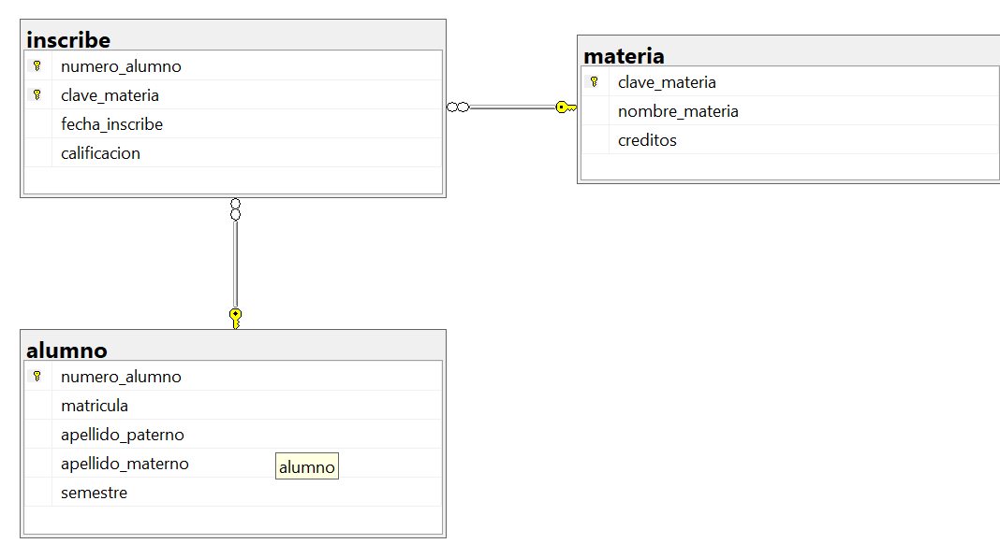

# Ejercicio 3 control de inscripciones 
```sql
CREATE DATABASE control_inscripciones;
GO

USE control_inscripciones;
GO 

CREATE TABLE alumno (
	numero_alumno INT NOT NULL IDENTITY(1,1),
	matricula VARCHAR(20) NOT NULL UNIQUE, 
	apellido_paterno VARCHAR(50) NOT NULL,
	apellido_materno VARCHAR(50),
	semestre TINYINT NOT NULL,
	CONSTRAINT pk_alumno
	PRIMARY KEY (numero_alumno),
	CONSTRAINT uq_alumno_matricula
	UNIQUE (matricula),
	CONSTRAINT ck_alumno_semestre
	CHECK (semestre BETWEEN 1 AND 12)
);
GO 

CREATE TABLE materia (
	clave_materia VARCHAR(10) NOT NULL,
	nombre_materia VARCHAR(50) NOT NULL UNIQUE,
	creditos INT NOT NULL,
	CONSTRAINT pk_materia
	PRIMARY KEY (clave_materia),
	CONSTRAINT uq_materia_nombre_materia
	UNIQUE (nombre_materia),
	CONSTRAINT ck_materia_creditos
	CHECK (creditos BETWEEN 1 AND 100)
);
GO 

CREATE TABLE inscribe(
	numero_alumno INT NOT NULL,
	clave_materia VARCHAR(10) NOT NULL,
	fecha_inscribe DATE NOT NULL, 
	calificacion DECIMAL(4,2),
	CONSTRAINT pk_inscribe
	PRIMARY KEY (numero_alumno, clave_materia),
	CONSTRAINT fk_inscribe_alumno
	FOREIGN KEY (numero_alumno)
	REFERENCES alumno(numero_alumno),
	CONSTRAINT fk_inscribe_materia
	FOREIGN KEY (clave_materia)
	REFERENCES materia(clave_materia)
	);
GO
```

