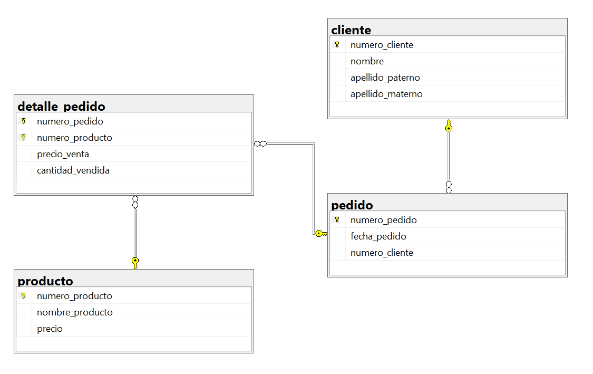

# Ejercicio 4 control ventas 
```sql
CREATE DATABASE control_ventas;
GO

USE control_ventas;
GO

CREATE TABLE cliente(
	numero_cliente INT NOT NULL IDENTITY(1,1),
	nombre VARCHAR(50) NOT NULL, 
	apellido_paterno VARCHAR(50) NOT NULL,
	apellido_materno VARCHAR(50),
	CONSTRAINT pk_cliente
	PRIMARY KEY (numero_cliente)

);
GO


CREATE TABLE pedido(
	numero_pedido INT NOT NULL IDENTITY(1,1),
	fecha_pedido DATE NOT NULL,
	numero_cliente INT NOT NULL,
	CONSTRAINT pk_pedido
	PRIMARY KEY (numero_pedido),
	CONSTRAINT fk_pedido_cliente
	FOREIGN KEY (numero_cliente)
	REFERENCES cliente(numero_cliente)
);
GO

CREATE TABLE producto(
	numero_producto INT NOT NULL IDENTITY(1,1),
	nombre_producto VARCHAR(50) NOT NULL,
	precio DECIMAL(10,2) NOT NULL,
	CONSTRAINT pk_producto
	PRIMARY KEY (numero_producto),
	CONSTRAINT uq_producto_nombre_producto
	UNIQUE (nombre_producto),
	CONSTRAINT ck_producto_precio
	CHECK (precio > 0)

);
GO

CREATE TABLE detalle_pedido(
	numero_pedido INT NOT NULL,
	numero_producto INT NOT NULL,
	precio_venta DECIMAL(10,2) NOT NULL,
	cantidad_vendida INT NOT NULL,
	CONSTRAINT pk_detalle_pedido
	PRIMARY KEY (numero_pedido, numero_producto),
	CONSTRAINT ck_detalle_pedido_precio_venta
	CHECK (precio_venta >0),
	CONSTRAINT ck_detalle_pedido_cantidad_vendida
	CHECK ( cantidad_vendida >0),
	CONSTRAINT fk_detalle_pedido_pedido
	FOREIGN KEY (numero_pedido)
	REFERENCES pedido(numero_pedido),
	CONSTRAINT fk_detalle_pedido_producto
	FOREIGN KEY (numero_producto)
	REFERENCES producto(numero_producto)
);
GO
```

